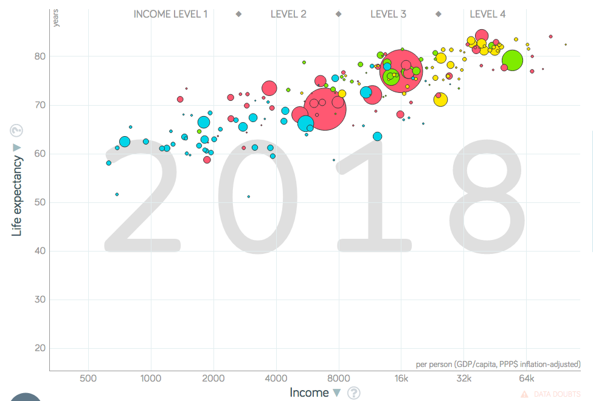
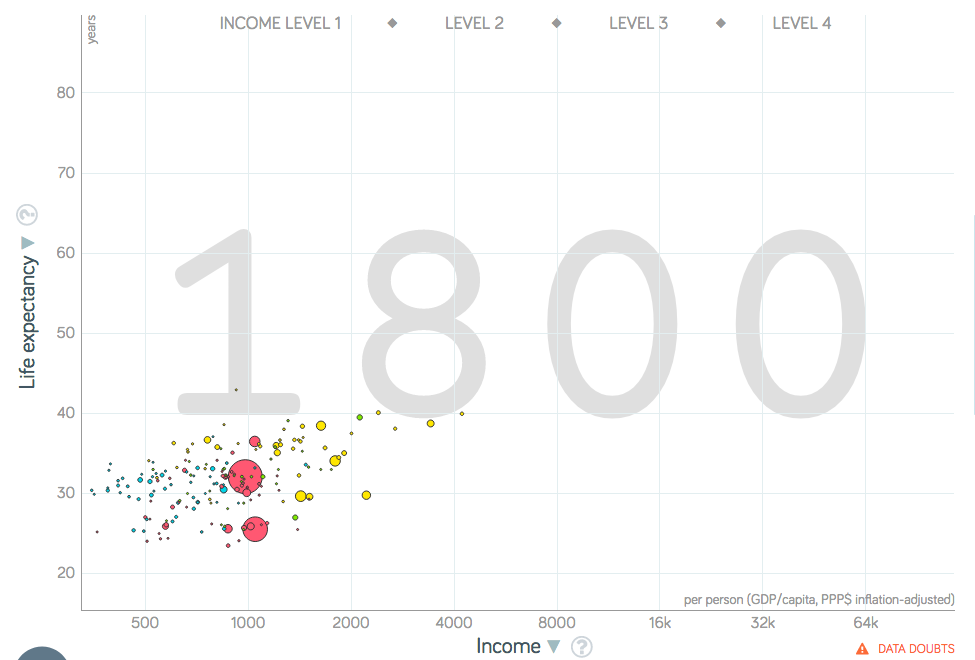
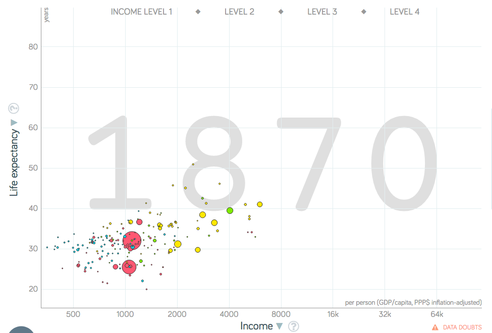
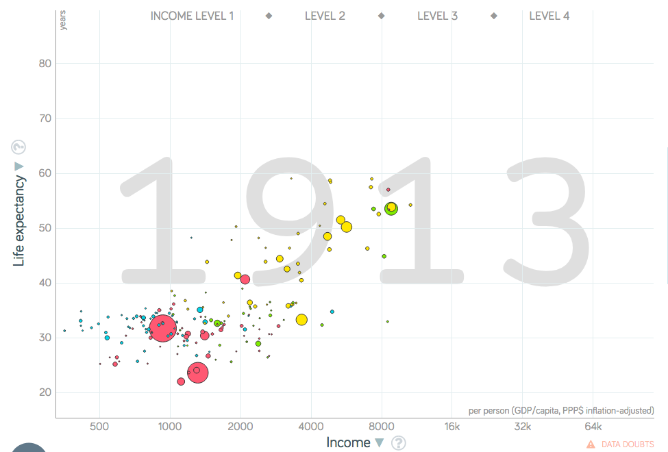
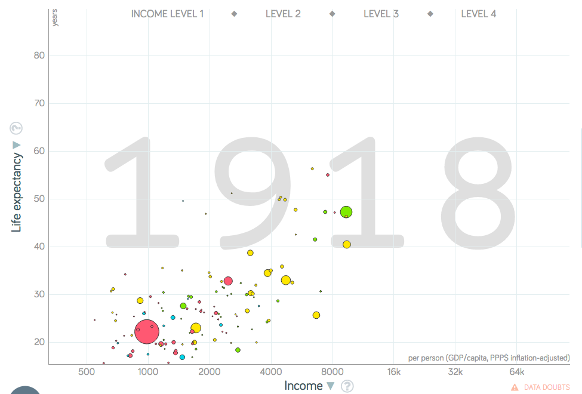
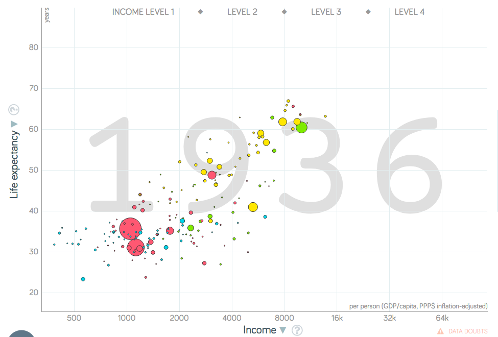
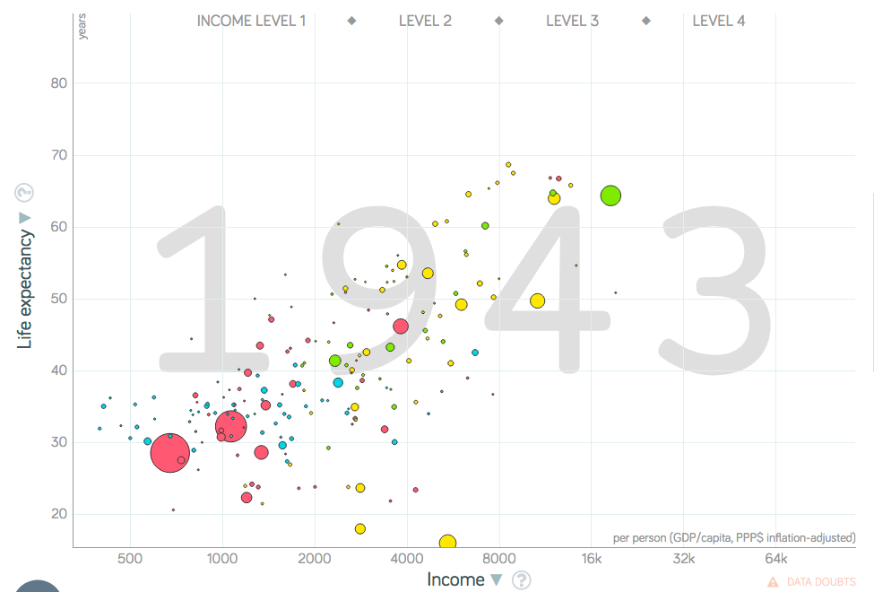
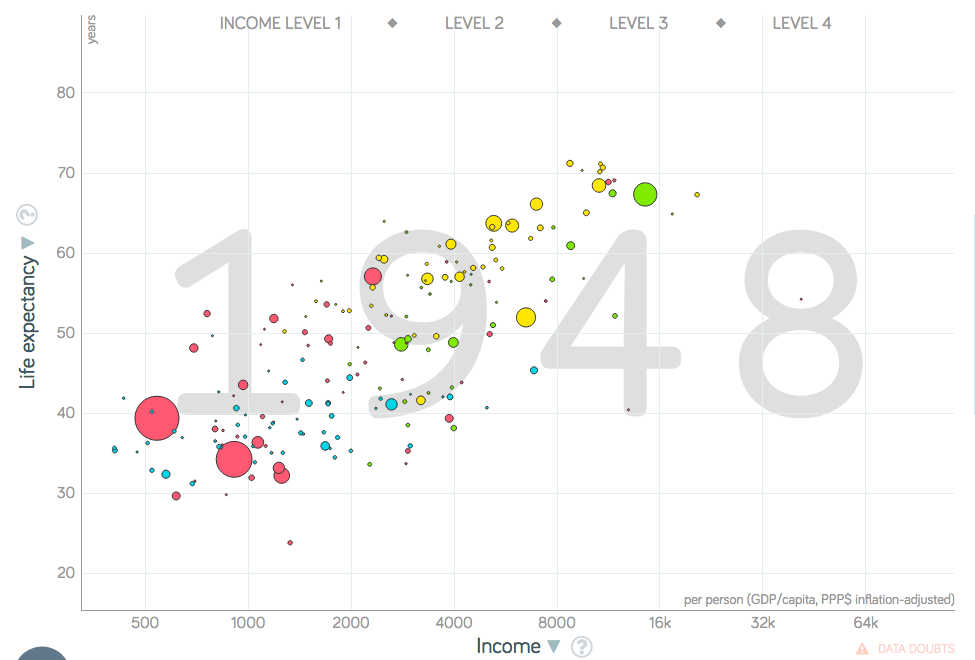
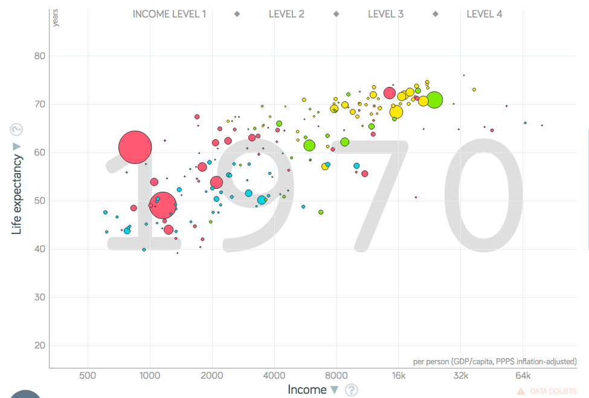

# Life Since 1800

## Intro to Gapminder Graphs

In this article, I will be using a lot of graphs like this:

Each bubble in the graph is a country, with the size corresponding to the population. For example, China (the giant bubble under "Level 3") is a large bubble due to its large population and Luxembourg (the bubble farthest to the right) is small due to its small population.  
In this graph, the y-axis is life expectancy, which is how long people live on average. In short, the higher a country, the healthier it is.  
The x-axis represents average income per person. In short, the farther right a country is, the richer it is.

## The World in 1800

The world in 1800 was horrible. As you can see from the graph, every country was sick and poor.

You may have noticed that the life expectancy was very low, with a world average of 31. This is not because adults lived short lives. In 1800 Sweden (the only country I could get this data for), if you lived to age 10, you could expect to live to age 56. The reason life expectancy was so low was because a lot of children died. The average family in 1800 had 6 children, but only 2 would survive to become parents on average.  
If this weren't depressing enough, most people in 1800 lived on under $2 a day and were illiterate. This was the grim reality of the world throughout history, from foragers to medieval peasants, all the way to 1800.

## The 1800s

When the Industrial Revolution happened, it had a huge effect on Western Europe and the U.S. Namely, it vastly increased their income. However, it did not improve their health much (with the exception of the Nordic Countries) as can be seen by the graph from 1870.

However, during the late 1800s, improvements in health (e.g. vaccines) drastically reduced the mortality of children in Western Europe and the U.S., as can be seen by this graph from 1913:

## Tragedies of the 1900s

### Flu

In 1918, there was a sudden drop in life expectancy, as can be shown from its graph compared to 1913's. While World War I played a role, the main culprit was the "Spanish" flu pandemic which killed at least 50 million people worldwide that year.

Despite the horrors of World War I and the 1918 flu, the world essentially shook it off and moved on.

### WWII

The world in 1936 had improved somewhat from the world in 1913 as shown in the graph; unfortunately, it was only a few years to the horrors of World War II.

WWII devastated large parts of the world, leading to many countries taking years to recover. It is unclear how many people total died in WWII, but it is clearly on the same magnitude as the flu from 1918. Even more depressingly, most of the deaths were likely civilians. Keep this in mind when looking at the graph from WWII.

## The World Improves

WWII changed the world drastically. It took years, but the world did recover from the war as can be shown from the post-war graph.

Unlike the earlier tragedies, countries in poorer areas of the world began to improve after WWII. At first, they improved in social progress as indicated by their increases in life expectancy.

Then, beginning around 1970, countries on the left of the graph began experiencing amazing economic growth, which brings us to today in 2018.

## The World Today

Here is a graph of the world in 2018:

As the graph shows, quality of life has improved dramatically. The world has never been a healthier or more prosperous place. In addition, the world is more educated than ever, with literacy at around 86%. Even though the world still faces many challenges, the world has never been more capable of facing them.

# Works Cited

Hans Rosling, Ola Rosling, and Anna Rosling Rönnlund, *Factfulness*, ISBN 978-1-250-10781-7  

Max Roser, "Life Expectancy", https://ourworldindata.org/life-expectancy

The Editors of Encyclopaedia Britannica, "Industrial Revolution", https://www.britannica.com/event/Industrial-Revolution

Dan Hillman, *Don't Panic - End Poverty*, https://www.gapminder.org/videos/dont-panic-end-poverty/

Mark Honigsbaum, "Spanish flu: the killer that still stalks us, 100 years on", https://www.theguardian.com/world/2018/sep/09/spanish-flu-pandemic-centenary-first-world-war

John Graham Royde-Smith and Thomas A. Hughes, "World War II", https://www.britannica.com/event/World-War-II

Uses free material from [GAPMINDER.ORG](http://gapminder.org), CC-BY LICENSE